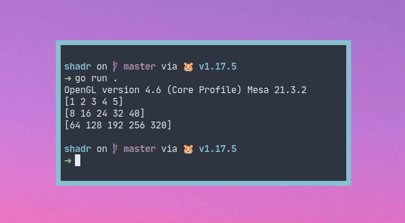

# shadr
## (compute shader using [go-gl/glfw](https://github.com/go-gl/glfw))

### structure
`main.go` contains intialisation\
`app.go` is the `fun` part

### resources
most of `main.go` is copied from [gl41core-cube](https://github.com/go-gl/example/tree/master/gl41core-cube)\
shader buffer from [opengl wiki](https://www.khronos.org/opengl/wiki/Shader_Storage_Buffer_Object)

